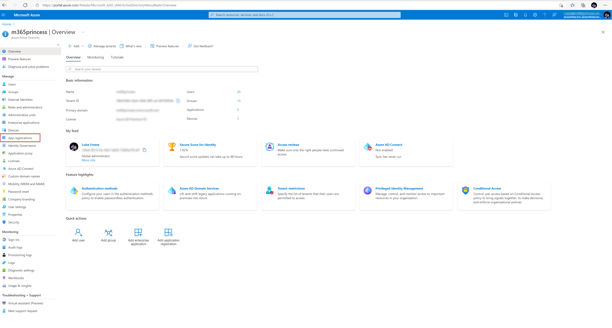
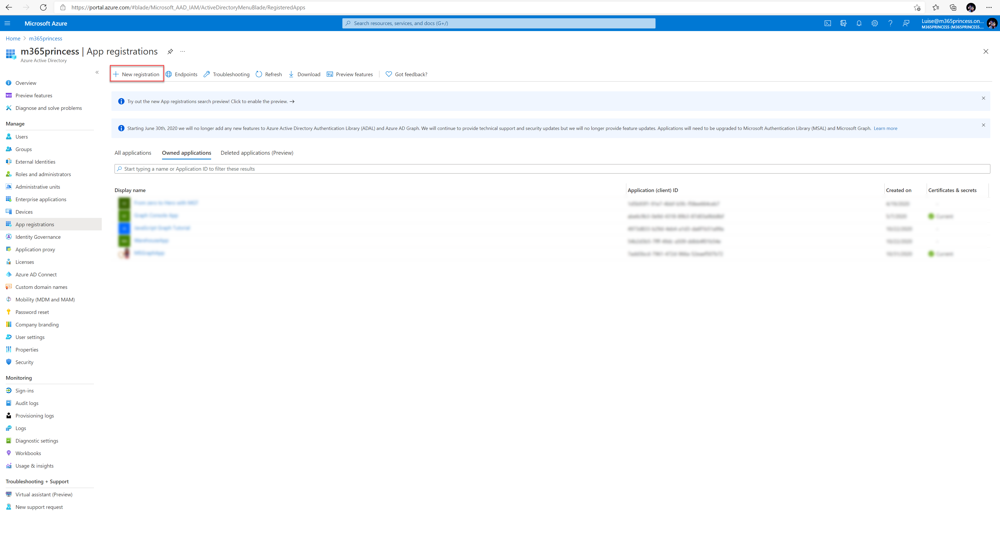
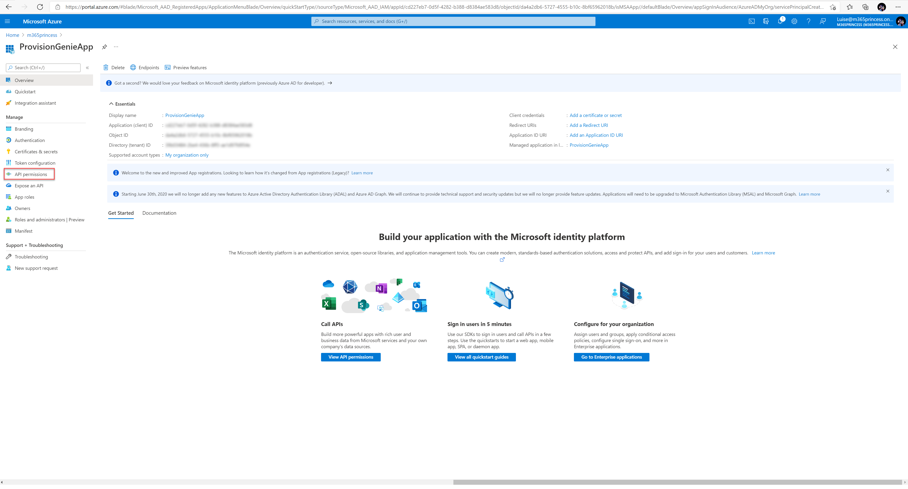
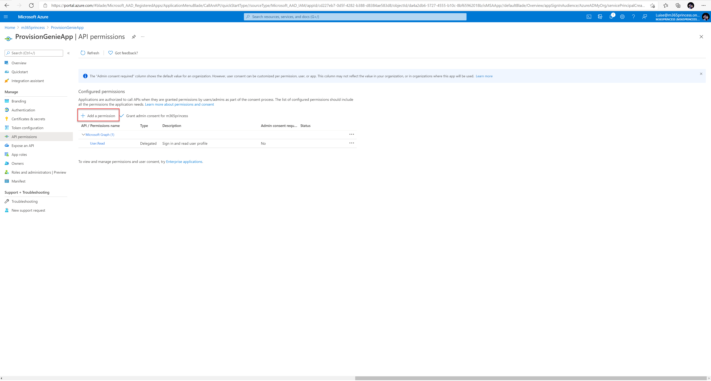
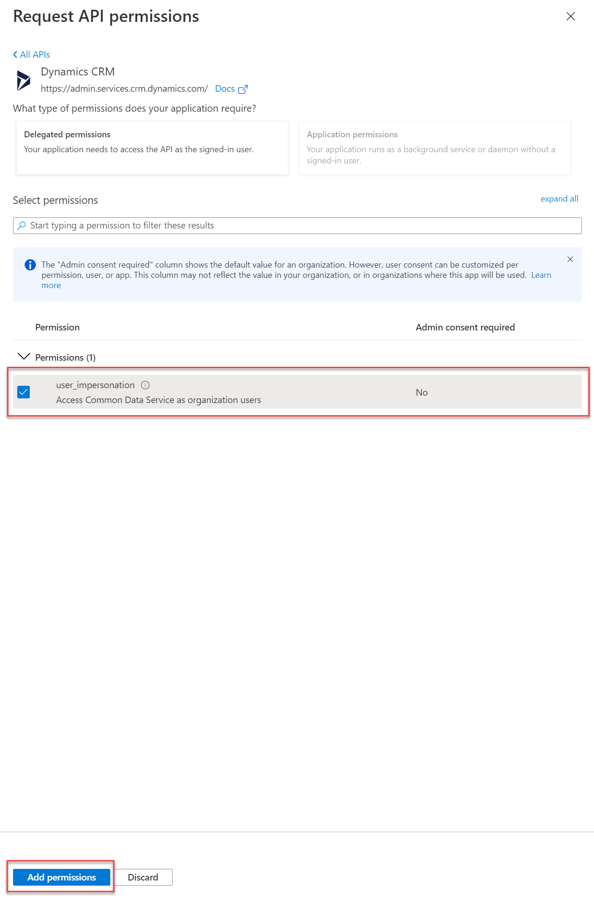
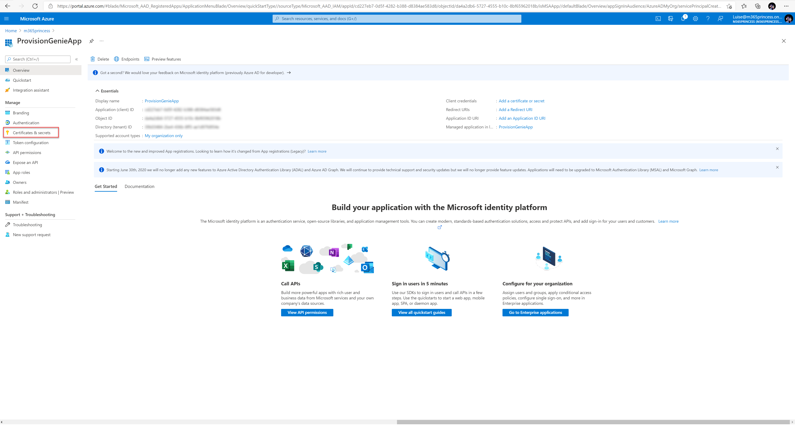
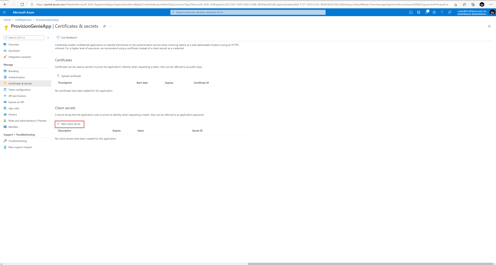
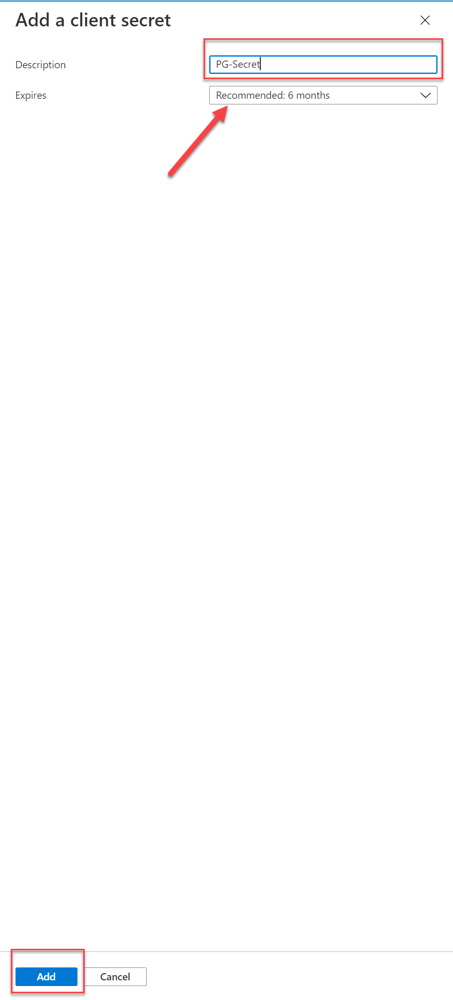

# Deployment Guide

This Guide shall guide you through the minmal path to awesome. It lists all steps required to successfully deploy ProvisionGenie in your tenant. 

🚨 still under construction

## Prerequisites

* Azure Subscription
* Microsoft 365 license
* Power Apps per app or Power Apps per user plan (for using Dataverse, please also see [Considerations about where to store data](Considerations-on-Dataverse.md)) 
* Environment with Dataverse database

> Please do this with your best knowledge about an environment strategy, please dont *rightclick --> publish

* Admin role

## Steps

### 1. App registration for Dataverse

* Go to [portal.azure.com](https://portal.azure.com)

* Log in
* Select **Azure Active Directory**

* Select **App registrations**

* select **New registration**
* Type in a name for your app like `ProvisionGenieApp` 
* Select **Accounts in this organizational directory only (\<your organization name> only - Single tenant)**
* Select **Register**

* Select **API permissions**

* Select **Add a permission**

* Select **Dynamics CRM**

* Select **user_impersonation**

* Select **Add permissions**
* Select **Certificates & secrets**

* Select **New client secret**

* Enter a description
* Select a value when this secret expires
* Select **Add** 

* Copy the secret's **Value** and save it somewhere

* Select **Overview** and copy the **Application (client) ID** value, save it somewhere
* Copy the **Directory (tenant) ID** value, save it somewhere

Now it's time to continue with

### 2. Managed identity
  * PS script

### 3. Deploy Logic Apps

<!-- 4. import the solution: Dataverse tables & Canvas App
5. Deploy Azure Logic Apps
  * fill in variables
4. 
5. test -->
### 4. Import solution: Dataverse tables & Canvas App

<!-- ### braindump

1. create a resource group either in UI or with CLI
2. app registration
3. deploy 
    * commondataservice hard coded/displayname
    * authenticate
    * https://vincentlauzon.com/2018/09/25/service-principal-for-logic-app-connector/ service principal
 -->
