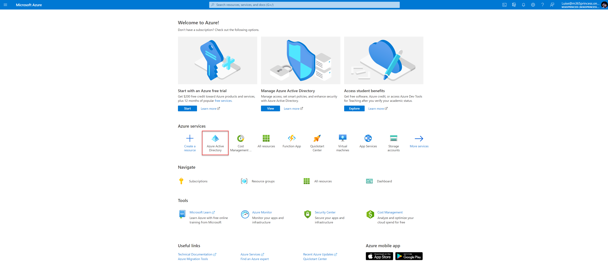
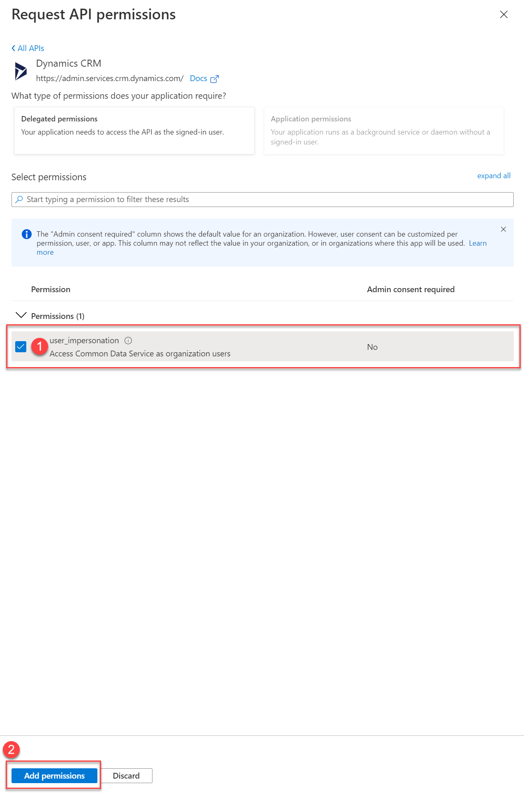
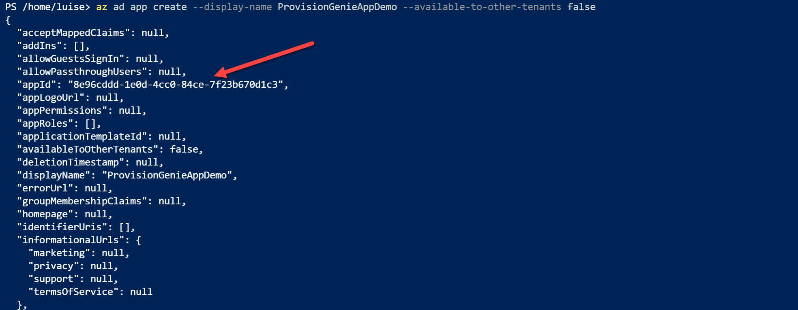
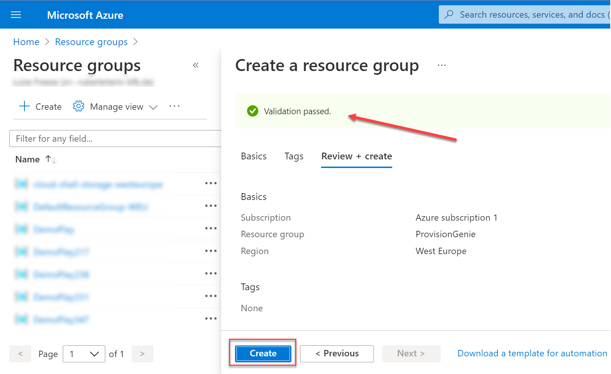

# Deployment Guide


This guide shall walk you through the minmal path to awesome. It lists all steps required to successfully deploy ProvisionGenie in your tenant. 

🚨 still under construction 💡

## Prerequisites

* Azure Subscription - if you don't have one, [get it here free](https://azure.microsoft.com/en-us/free) - please also see [Cost estimation](CostEstimation.md)
* Microsoft 365 license 
* [Power Apps per app or Power Apps per user plan](https://powerapps.microsoft.com/en-us/pricing/) (for using Dataverse, please also see [Considerations about where to store data](Considerations-on-Dataverse.md)) 
* Environment with [Dataverse database](https://docs.microsoft.com/en-us/power-platform/admin/create-database)

> Please do this with your best knowledge about an environment strategy, please dont *rightclick --> publish 💡

<!-- * Admin role -->

## Steps

### 1. App registration for deployment of Dataverse tables

#### App registration for deployment of Dataverse tables using in Azure portal

You will need to register an app in Azure AD in order to deploy the dataverse tables to your tenant. You can register the app either in the Azure Portal or in a CLI of your choice (PowerShell, CLI for Microsoft 365, Azure CLI). This guide provides you with an option to use the Azure portal and Azure ClI. If you prefer to use Azure CLI, please select [App registration with Azure CLI](DeploymentGuide.md#App-registration-for-deployment-of-Dataverse-tables-using-in-Azure-portal)

* Go to [portal.azure.com](https://portal.azure.com)
* Log in
* Select **Azure Active Directory**



* (1) Select **App registrations**
* (2) Select **New registration**


* (1) Type in a name for your app like `ProvisionGenieApp` 
* (2) Select **Accounts in this organizational directory only (\<your organization name> only - Single tenant)**
* (3) Select **Register**


* (1) Select **API permissions**
* (2) Select **Add a permission**
* (3) Select **Dynamics CRM**


* (1) Select **user_impersonation**
* (2) Select **Add permissions**



* (1) Select **Certificates & secrets**
* (2) Select **New client secret** 
* (3) Enter a description like `PG-secret`
* (4) Select a value when this secret expires
* (5) Select **Add** 


* Copy the secret's **Value** and save it somewhere


* (1) Select **Overview**
* (2) Copy the **Application (client) ID** value, save it somewhere
* (3) Copy the **Directory (tenant) ID** value, save it somewhere


That's it!

#### App registration for deployment of Dataverse tables using in Azure portal

The alternative for the steps above using the Azure portal is using Azure CLI. Please follow these steps: 

* Open [shell.azure.com](https://portal.azure.com/#cloudshell/)
* to register the application run

```
az ad app create --display-name ProvisionGenieAppDemo --available-to-other-tenants false
```

* Copy the value of the **AppId** from the output 



To create an app secret, run

```
az ad app credential reset --id <your-AppID-here> --append
```

In the output, you will get four values for 

* **AppId**, 
* **name** (equals **AppId**), 
* **password** (this is your App secret) and 
* **tenant** (this is your Tenant ID). 

* Save these values somewhere
* Create a service principal with 

```
 az ad sp create --id <your-AppID-here>
```

* Set API permissions for user impersonation in Dynamics CRM

```
az ad app permission add --id <your-AppID-here> --api 00000007-0000-0000-c000-000000000000 --api-permissions 78ce3f0f-a1ce-49c2-8cde-64b5c0896db4=Role
```

Please note, that `00000007-0000-0000-c000-000000000000` is Dynamics CRM and `78ce3f0f-a1ce-49c2-8cde-64b5c0896db4=Role` is **user_impersonation** which we need to act on behalf of a user. 

* now grant admin consent with running 

```
az ad app permission grant --id <your-AppID-here> --api 00000007-0000-0000-c000-000000000000
```

That's it! 

### 2. Create a new Azure resource group

The yet-to-deploy Azure Logic Apps will need a resource group to be deployed in. We recommand creating a new resource group. You can do this [via the Azure portal](DeploymentGuide.md#new-resource-group-with-Azure-portal) or [via Azure CLI](DeploymentGuide.md#new-resource-group-with-Azure-cli). 

#### New resource group with Azure Cli

* open [shell.azure.com](https://portal.azure.com/#cloudshell/)
* run

```
az group create -n <your-resourcegroupname-here> --location <your-location-here>
```

On success, you will see this in the output: 


#### New resource group with Azure portal

As an alternative to use Azure CLI to create a new resource group, you can also complete the following steps in the Azure portal: 

* Go to [portal.azure.com](https://portal.azure.com)
* Log in
* (1) Select the Menu
* (2) Select **Resource groups**


* Select **Create**
* Select a subscription
* Enter the name of the Resource Group you wish to create, like `PG-Demo`
* Select the region
* Select **Review & create**


* Notice the banner showing that validation passed
* Select **Create**



On success, your new resource group will show up in the overview:


That's it! 


<!-- 🚨🚨🚨🚨 in
Now it's time to continue with

### 2. Managed identity
  * PS script

### 3. Deploy Logic Apps

4. import the solution: Dataverse tables & Canvas App
5. Deploy Azure Logic Apps
  * fill in variables
4. 
5. test
### 4. Import solution: Dataverse tables & Canvas App

 ### braindump


1. create a resource group either in UI or with CLI
2. app registration
3. deploy 
    * commondataservice hard coded/displayname
    * authenticate
    * https://vincentlauzon.com/2018/09/25/service-principal-for-logic-app-connector/ service principal
 -->
